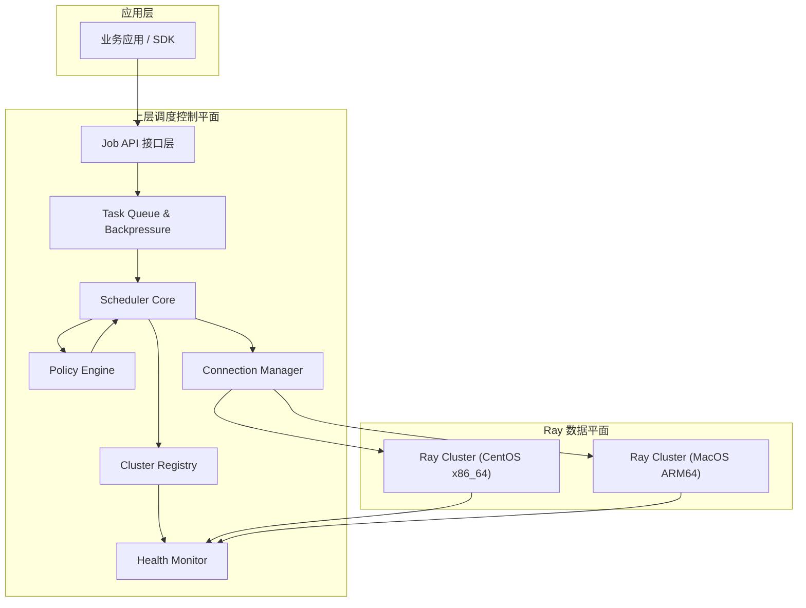
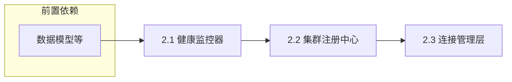
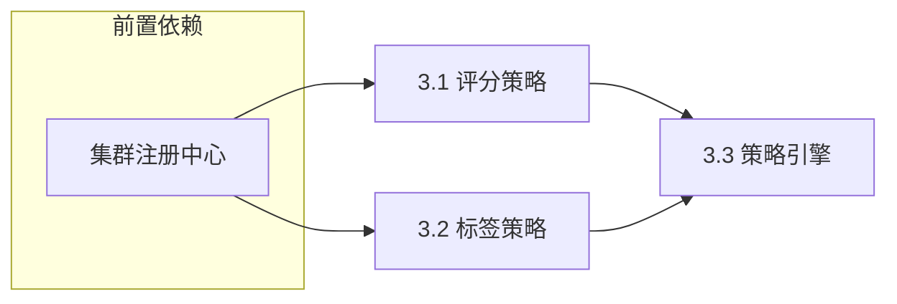
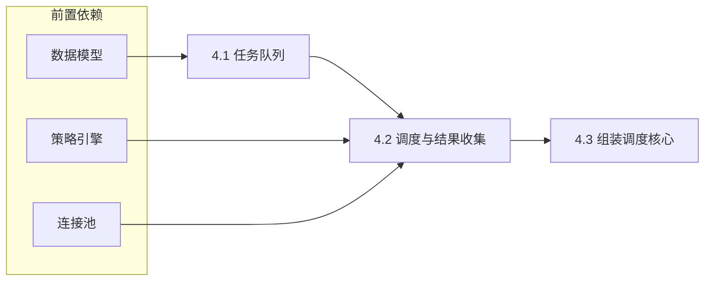
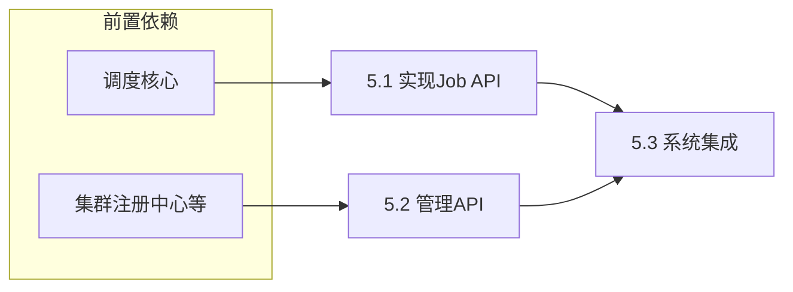

# 你的角色
你是一位在分布式计算领域的顶级 Ray 系统开发实施工程师，你当前正在参与研发一款 Ray 异构集群的调度框架

# 【任务目标】
根据系统总体设计方案与项目整体开发实施计划，完整框架开发工作

# 【总体设计方案】
下面给出**严格基于你提供的调度用例思想，但不输出任何源码实现**的**Ray 异构集群上层调度框架架构设计**。内容聚焦**系统分层、模块职责、调度语义、依赖关系**，满足你提出的三个【必须】系统功能需求，并遵循良好的架构设计原则（单一职责、解耦、可扩展、可观测）。

---

## 总体设计目标

设计一套**独立于 Ray 内部调度器之上的“上层调度管理框架”**，用于在 **CentOS（x86_64）与 MacOS（ARM64）多个 Ray Cluster 之间**进行统一资源感知、负载均衡与任务编排。

该框架的核心目标是：

1. **多 Ray Cluster 统一视图**
   将多个异构 Ray 集群抽象为一个“逻辑资源池”，对上层应用透明。

2. **策略可插拔的调度决策**
   根据集群健康度、资源余量、权重、标签（OS / 架构 / GPU）等因素，进行智能调度。

3. **任务级强一致执行语义**

   * 应用层提交 Ray task / actor
   * 调度器选择集群
   * 等待远程执行结果
   * 失败即抛异常（不吞错）

4. **具备排队与背压能力**
   当集群负载过高或资源不足时，任务进入队列等待，而非盲目失败。

---

## 【系统架构图】



---

## 【系统项目结构树】

```plaintext
ray_multicluster_scheduler/
├── app/
│   └── client_api/
│       ├── submit_task
│       └── submit_actor
│
├── scheduler/
│   ├── scheduler_core/
│   │   ├── dispatcher
│   │   ├── task_lifecycle
│   │   └── result_collector
│   │
│   ├── queue/
│   │   ├── task_queue
│   │   └── backpressure_controller
│   │
│   ├── policy/
│   │   ├── score_based_policy
│   │   ├── tag_affinity_policy
│   │   └── weighted_preference_policy
│   │
│   ├── cluster/
│   │   ├── cluster_registry
│   │   ├── cluster_metadata
│   │   └── resource_snapshot
│   │
│   ├── health/
│   │   ├── health_checker
│   │   └── metrics_aggregator
│   │
│   └── connection/
│       ├── ray_client_pool
│       └── connection_lifecycle
│
├── common/
│   ├── model/
│   ├── exception/
│   └── logging/
│
└── control_plane/
    ├── config
    └── admin_api
```

---

## 【系统模块说明】

### 1️⃣ 应用层（AppLayer）

**职责**

* 向调度器提交：

  * Ray remote function
  * Ray actor class
* 同步等待执行结果
* 不感知底层集群差异

**特点**

* 对业务代码侵入极小
* 不直接调用 `ray.init()`

---

### 2️⃣ Job API 接口层（Job API）

**职责**

* 接收应用层任务请求
* 统一封装任务描述：

  * 代码对象
  * 资源需求（CPU / GPU）
  * 架构标签（arm64 / x86_64）
* 转交给任务队列

---

### 3️⃣ Task Queue & Backpressure（任务队列与背压）

**职责**

* 维护全局任务队列
* 控制并发提交速率
* 当：

  * 所有集群资源紧张
  * 或策略不满足
    → 任务排队等待

**设计原则**

* FIFO / 优先级队列可扩展
* 明确“排队 ≠ 失败”

✅ **满足需求 3：维护任务队列**

---

### 4️⃣ Scheduler Core（调度核心）

**职责**

* 从队列中取任务
* 请求调度策略决策
* 绑定任务 → 目标集群
* 驱动执行生命周期：

  * 提交
  * 等待
  * 成功 / 失败回传

**这是整个系统的大脑**

---

### 5️⃣ Policy Engine（调度策略引擎）

**职责**

* 根据 Cluster Snapshot 计算调度结果
* 支持多策略组合：

  * 资源剩余评分
  * 权重偏好（CentOS 常驻 / Mac 弹性）
  * 标签亲和（ARM64 专属）

**特点**

* 可插拔
* 不关心 Ray 连接细节

---

### 6️⃣ Cluster Registry（集群注册中心）

**职责**

* 维护所有 Ray Cluster 的：

  * 地址
  * 架构
  * 权重
  * 标签
* 提供统一查询接口

---

### 7️⃣ Health Monitor（集群健康监控）

**职责**

* 定期采集：

  * available_resources
  * cluster_resources
  * node 数
* 形成资源快照（Snapshot）
* 不参与调度决策，仅提供事实数据

---

### 8️⃣ Connection Manager（Ray 连接管理）

**职责**

* 维护 Ray Client / Ray Job 连接池
* 保证：

  * 一个任务只连接一个集群
  * 连接生命周期可控
* 执行真正的 `ray.remote` 提交

✅ **满足需求 1：将 task / actor 分配到特定集群**

---

### 9️⃣ Result Collector（结果回收）

**职责**

* 同步等待 Ray future
* 成功 → 返回结果
* 失败 → 抛出异常（不中断系统）

✅ **满足需求 2：等待结果 & 失败抛异常**

---

## 【模块依赖链】

```text
Application
  ↓
Job API
  ↓
Task Queue
  ↓
Scheduler Core
  ↓
Policy Engine
  ↓
Cluster Registry
  ↓
Health Monitor
  ↓
Connection Manager
  ↓
Ray Cluster
  ↓
Result Collector
  ↓
Application
```

---

## 调度设计总结（架构级）

| 维度   | 设计选择         |
| ---- | ------------ |
| 调度层级 | Ray 之上（控制平面） |
| 异构支持 | OS / 架构 / 标签 |
| 调度策略 | 可插拔、多因子评分    |
| 执行语义 | 同步、强一致       |
| 背压能力 | 队列化          |
| 可扩展性 | 支持 N 个集群     |

---

### 🔑 一句话总结

> **这是一个“Ray Cluster 之上的 Kubernetes 风格调度控制平面”，Ray 只负责单集群执行，而你这个系统负责“选哪个 Ray 集群”。**

如果你愿意，下一步我可以帮你进一步：

* 把该架构**映射到 KubeRay + RayJob**
* 或设计 **Scheduler 与 Ray Serve / Actor Pool 的结合方案**
* 或给出 **生产级失败重试 / 熔断设计**

你可以直接指定下一步方向。


# 【项目完整实施计划】
# 项目总体目标
构建一个独立于Ray内部调度器之上的“上层调度管理框架”，实现对多个异构Ray集群（CentOS x86_64与MacOS ARM64）的统一资源视图、策略化调度、强一致任务执行与背压管理，为上层应用提供透明、可靠的分布式计算服务。

# 项目开发模式
本项目采用“自底向上、分层构建、模块解耦、并行开发”的模式。核心原则如下：
1.  **底层模块优先**：优先实施不依赖其他系统模块的基础设施和数据处理模块（如数据模型、异常处理、配置管理）。
2.  **依赖驱动编排**：严格遵循架构设计的依赖链（如 `Health Monitor` -> `Cluster Registry` -> `Policy Engine` -> `Scheduler Core`）。上游模块的开发基于下游模块提供的稳定接口。
3.  **阶段化与递归分解**：将整体开发分解为多个逻辑阶段，每个阶段聚焦一组功能集，阶段内的任务进一步递归分解为可直接编码的最小实施单元（通常对应1-2个模块文件）。
4.  **模块化并行**：在明确接口契约的前提下，允许独立模块并行开发（如 `Health` 监控与 `Connection` 管理），提升整体开发效率。

# 项目实施阶段任务

### 第一阶段：基础数据模型与系统基石
**目标**：定义系统核心数据结构、异常体系、日志配置，为所有上层模块提供统一的编程接口和运行基础。
#### 阶段子任务列表
##### 1.1: 定义核心数据模型 (`common/model`)
- 1.1.1 实施内容：定义 `TaskDescription`, `ClusterMetadata`, `ResourceSnapshot`, `SchedulingDecision` 等核心数据类，明确其字段、类型及序列化方法。
- 1.1.2 依赖项：无。
- 1.1.3 交付模块文件：`ray_multicluster_scheduler/common/model/__init__.py`

##### 1.2: 构建异常处理框架 (`common/exception`)
- 1.2.1 实施内容：定义项目级基础异常（如 `SchedulerError`）及关键领域异常（如 `NoHealthyClusterError`, `TaskSubmissionError`, `PolicyEvaluationError`）。
- 1.2.2 依赖项：无。
- 1.2.3 交付模块文件：`ray_multicluster_scheduler/common/exception/__init__.py`

##### 1.3: 配置日志与工具 (`common/logging`, `control_plane/config`)
- 1.3.1 实施内容：配置项目级结构化日志；实现基础配置管理，支持从环境变量或配置文件读取集群列表、健康检查间隔等。
- 1.3.2 依赖项：无。
- 1.3.3 交付模块文件：
    - `ray_multicluster_scheduler/common/logging/__init__.py`
    - `ray_multicluster_scheduler/control_plane/config/__init__.py`

#### 子任务实施路径


### 第二阶段：集群感知与状态维护
**目标**：实现集群状态（资源、健康度）的实时感知与统一注册管理，为调度决策提供准确的数据源。
#### 阶段子任务列表
##### 2.1: 实现健康监控器 (`health/health_checker`)
- 2.1.1 实施内容：实现 `HealthChecker` 类，通过 Ray Client 定期轮询各集群的 `available_resources`、`cluster_resources` 及节点状态，组装 `ResourceSnapshot`。
- 2.1.2 依赖项：`common/model` (ResourceSnapshot), `common/logging`, `control_plane/config`。
- 2.1.3 交付模块文件：`ray_multicluster_scheduler/scheduler/health/health_checker.py`

##### 2.2: 实现集群注册中心 (`cluster/cluster_registry`, `cluster/cluster_metadata`)
- 2.2.1 实施内容：实现 `ClusterRegistry` 类，维护静态的 `ClusterMetadata` 列表（地址、标签、权重），并提供注册、查询、获取最新 `ResourceSnapshot` 的接口。
- 2.2.2 依赖项：`common/model` (ClusterMetadata, ResourceSnapshot), `health_checker` (作为数据提供者)。
- 2.2.3 交付模块文件：
    - `ray_multicluster_scheduler/scheduler/cluster/cluster_registry.py`
    - `ray_multicluster_scheduler/scheduler/cluster/cluster_metadata.py`

##### 2.3: 实现连接管理层 (`connection/ray_client_pool`, `connection/connection_lifecycle`)
- 2.3.1 实施内容：实现 `RayClientPool` 类，管理到各集群的 Ray Client 连接池，负责连接的创建、缓存、复用和优雅关闭，确保任务提交时能快速获取有效连接。
- 2.3.2 依赖项：`cluster_registry` (获取集群地址), `common/logging`。
- 2.3.3 交付模块文件：
    - `ray_multicluster_scheduler/scheduler/connection/ray_client_pool.py`
    - `ray_multicluster_scheduler/scheduler/connection/connection_lifecycle.py`

#### 子任务实施路径


### 第三阶段：调度策略与决策引擎
**目标**：实现可插拔的调度策略，并构建策略引擎，能够基于集群状态计算最优调度目标。
#### 阶段子任务列表
##### 3.1: 实现基础评分策略 (`policy/score_based_policy`)
- 3.1.1 实施内容：实现 `ScoreBasedPolicy` 类，根据集群的可用 CPU/GPU 资源余量进行归一化评分，选择分数最高的集群。
- 3.1.2 依赖项：`cluster_registry` (获取集群快照), `common/model` (TaskDescription, SchedulingDecision)。
- 3.1.3 交付模块文件：`ray_multicluster_scheduler/scheduler/policy/score_based_policy.py`

##### 3.2: 实现标签亲和策略 (`policy/tag_affinity_policy`)
- 3.2.1 实施内容：实现 `TagAffinityPolicy` 类，优先将任务调度到与其 `arch` 标签匹配的集群（如 `arm64` 任务发往 MacOS 集群）。
- 3.2.2 依赖项：同 3.1.2。
- 3.2.3 交付模块文件：`ray_multicluster_scheduler/scheduler/policy/tag_affinity_policy.py`

##### 3.3: 构建策略引擎 (`policy/`)
- 3.3.1 实施内容：实现 `PolicyEngine` 类，支持策略的注册、组合（如链式、加权）与执行。提供统一的 `schedule(task_desc, cluster_snapshots)` 接口。
- 3.3.2 依赖项：`policy/score_based_policy`, `policy/tag_affinity_policy`。
- 3.3.3 交付模块文件：`ray_multicluster_scheduler/scheduler/policy/__init__.py` (或 `policy_engine.py`)

#### 子任务实施路径


### 第四阶段：调度核心与任务执行流
**目标**：实现调度系统的大脑，串联任务队列、策略决策、连接执行与结果回收的完整生命周期。
#### 阶段子任务列表
##### 4.1: 实现任务队列与背压控制器 (`queue/task_queue`, `queue/backpressure_controller`)
- 4.1.1 实施内容：实现 `TaskQueue` (支持 FIFO/优先级) 和 `BackpressureController`，当所有集群负载过高时，暂停从队列中拉取任务。
- 4.1.2 依赖项：`common/model` (TaskDescription)。
- 4.1.3 交付模块文件：
    - `ray_multicluster_scheduler/scheduler/queue/task_queue.py`
    - `ray_multicluster_scheduler/scheduler/queue/backpressure_controller.py`

##### 4.2: 实现调度核心与结果收集器 (`scheduler_core/dispatcher`, `scheduler_core/result_collector`)
- 4.2.1 实施内容：实现 `Dispatcher`，从队列取任务，调用策略引擎决策，通过连接池提交任务，并返回 `future`。实现 `ResultCollector` 同步等待 `future` 完成，处理成功结果或封装异常。
- 4.2.2 依赖项：`policy_engine`, `ray_client_pool`, `task_queue`, `common/model`。
- 4.2.3 交付模块文件：
    - `ray_multicluster_scheduler/scheduler/scheduler_core/dispatcher.py`
    - `ray_multicluster_scheduler/scheduler/scheduler_core/result_collector.py`

##### 4.3: 组装调度核心服务 (`scheduler_core/task_lifecycle`)
- 4.3.1 实施内容：实现 `SchedulerCore` 类，整合 `Dispatcher`、`ResultCollector` 和背压控制，提供 `submit_task` 和 `submit_actor` 主循环或异步接口，管理任务完整生命周期。
- 4.3.2 依赖项：`dispatcher`, `result_collector`, `backpressure_controller`。
- 4.3.3 交付模块文件：`ray_multicluster_scheduler/scheduler/scheduler_core/task_lifecycle.py`

#### 子任务实施路径


### 第五阶段：应用接口与系统集成
**目标**：暴露对用户友好的 API，并集成所有模块，形成可运行的系统。
#### 阶段子任务列表
##### 5.1: 实现 Job API 接口层 (`app/client_api/submit_task`, `app/client_api/submit_actor`)
- 5.1.1 实施内容：实现用户侧 SDK，提供 `submit_task(fn, args, kwargs, resource_requirements, tags)` 和 `submit_actor(cls, ...)` 函数。内部调用 `SchedulerCore`。
- 5.1.2 依赖项：`scheduler_core`。
- 5.1.3 交付模块文件：
    - `ray_multicluster_scheduler/app/client_api/submit_task.py`
    - `ray_multicluster_scheduler/app/client_api/submit_actor.py`

##### 5.2: 实现控制平面与管理API (`control_plane/admin_api`)
- 5.2.1 实施内容：实现简单的管理接口（如 REST 或 CLI），用于查看集群状态、队列长度、手动触发健康检查等。
- 5.2.2 依赖项：`cluster_registry`, `task_queue`, `health_checker`。
- 5.2.3 交付模块文件：`ray_multicluster_scheduler/control_plane/admin_api/__init__.py`

##### 5.3: 系统集成与端到端测试
- 5.3.1 实施内容：编写主程序入口，初始化所有组件（配置、注册中心、健康检查、调度核心）。编写端到端集成测试，验证从 API 提交任务到获取结果的完整流程。
- 5.3.2 依赖项：所有前述模块。
- 5.3.3 交付模块文件：
    - `ray_multicluster_scheduler/__main__.py` (或 `main.py`)
    - `tests/integration/test_e2e_workflow.py`

#### 子任务实施路径


### 第六阶段：进阶功能与生产就绪
**目标**：增强系统的健壮性、可观测性和高级调度能力。
#### 阶段子任务列表
##### 6.1: 实现指标聚合与可观测性 (`health/metrics_aggregator`)
- 6.1.1 实施内容：扩展 `HealthMonitor` 或新增 `MetricsAggregator`，收集并暴露 Prometheus 格式的指标（如各集群资源使用率、任务排队时间、调度成功率）。
- 6.1.2 依赖项：`health_checker`, `task_queue`。
- 6.1.3 交付模块文件：`ray_multicluster_scheduler/scheduler/health/metrics_aggregator.py`

##### 6.2: 实现权重偏好策略 (`policy/weighted_preference_policy`)
- 6.2.1 实施内容：实现 `WeightedPreferencePolicy`，允许为集群配置静态权重，结合资源评分进行加权决策，实现如“CentOS 常驻，Mac 弹性”的调度倾向。
- 6.2.2 依赖项：`cluster_registry`, `common/model`。
- 6.2.3 交付模块文件：`ray_multicluster_scheduler/scheduler/policy/weighted_preference_policy.py`

##### 6.3: 完善失败重试与熔断机制
- 6.3.1 实施内容：在 `SchedulerCore` 或 `Dispatcher` 中引入任务级别重试逻辑（可配置次数、退避策略）。在 `HealthChecker` 或 `ConnectionManager` 中为频繁失败的集群引入熔断器。
- 6.3.2 依赖项：`scheduler_core`, `health_checker`, `connection`。
- 6.3.3 交付模块文件：修改 `scheduler/scheduler_core/task_lifecycle.py` 和 `scheduler/health/health_checker.py`，或新增 `common/circuit_breaker.py`。

# 【约束条件】
- 1. 严格遵守项目开发计划
- 2. 核心功能模块必须进行**单元测试**，组合模块必须进行**集成测试**
- 3. 消除一切 bug

# 【Ray 系统集群信息】
ClusterConfig= {
    "centos": ClusterConfig(
        name="centos",
        head_address="192.168.5.7:32546",
        dashboard="http://192.168.5.7:31591",
        prefer=False,
        weight=1.0,
        tags=["linux", "x86_64"]
    ),
    "mac": ClusterConfig(
        name="mac",
        head_address="192.168.5.2:32546",
        dashboard="http://192.168.5.2:8265",
        prefer=True,
        weight=1.2,  # 偏好集群权重更高
        tags=["macos", "arm64"]
    )
}

# 【任务需求】
- 1. 根据项目计划与任务实施路径的安排，按照依赖倒置原则，依次完成系统指定模块的开发
- 2. 实现一个简单的 ray job 提交到集群进行调度的测试用例
- 3. 将完整项目配置成 PyPi python 安装包，包名为“ray_multicluster_scheduler”, 并安装在本地 conda ts 虚拟环境
