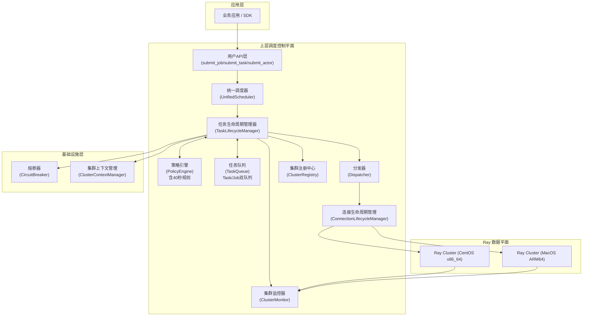
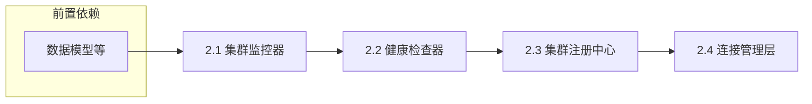
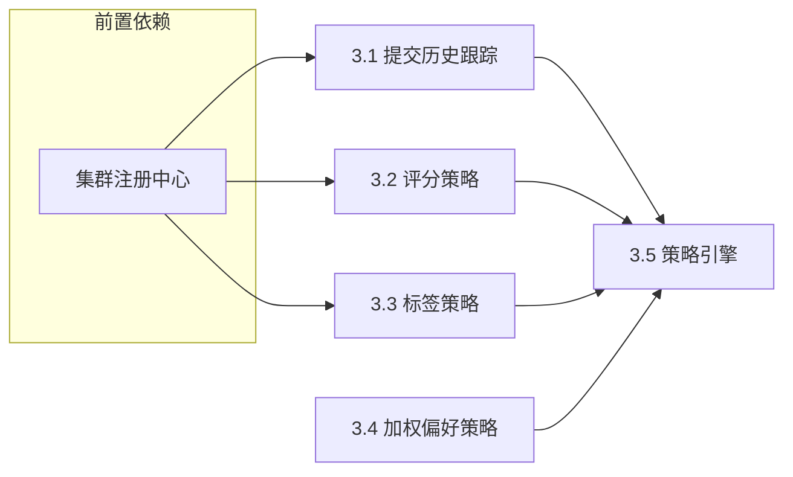
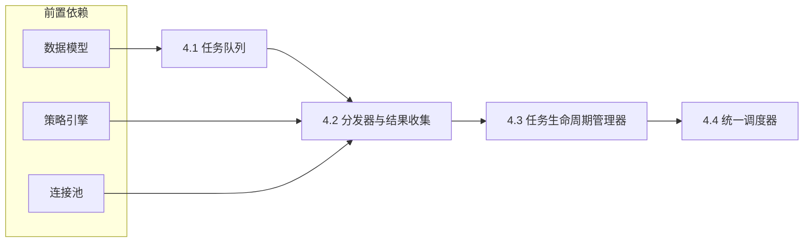
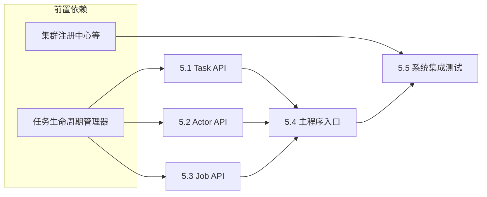

# 你的角色
你是一位在分布式计算领域的顶级 Ray 系统开发实施工程师，你当前正在参与研发一款 Ray 异构集群的调度框架

# 【任务目标】
根据系统总体设计方案与项目整体开发实施计划，完整框架开发工作

# 【总体设计方案】
下面给出**严格基于你提供的调度用例思想，但不输出任何源码实现**的**Ray 异构集群上层调度框架架构设计**。内容聚焦**系统分层、模块职责、调度语义、依赖关系**，满足你提出的三个【必须】系统功能需求，并遵循良好的架构设计原则（单一职责、解耦、可扩展、可观测）。

---

## 总体设计目标

设计一套**独立于 Ray 内部调度器之上的“上层调度管理框架”**，用于在 **CentOS（x86_64）与 MacOS（ARM64）多个 Ray Cluster 之间**进行统一资源感知、负载均衡与任务编排。

该框架的核心目标是：

1. **多 Ray Cluster 统一视图**
   将多个异构 Ray 集群抽象为一个“逻辑资源池”，对上层应用透明。

2. **策略可插拔的调度决策**
   根据集群健康度、资源余量、权重、标签（OS / 架构 / GPU）等因素，进行智能调度。

3. **任务级强一致执行语义**

   * 应用层提交 Ray task / actor
   * 调度器选择集群
   * 等待远程执行结果
   * 失败即抛异常（不吞错）

4. **具备排队与背压能力**
   当集群负载过高或资源不足时，任务进入队列等待，而非盲目失败。

---

## 【系统架构图】



---

## 【系统项目结构树】

```plaintext
ray_multicluster_scheduler/
├── app/
│   └── client_api/
│       ├── submit_task.py           # Task 提交 API (199行)
│       ├── submit_actor.py          # Actor 提交 API (313行)
│       ├── submit_job.py            # Job 提交 API (620行)
│       └── unified_scheduler.py     # 统一调度器接口 (693行)
│
├── scheduler/
│   ├── lifecycle/                   # 【核心】任务生命周期管理
│   │   └── task_lifecycle_manager.py  # 任务生命周期管理器 (1182行)
│   │
│   ├── scheduler_core/
│   │   ├── dispatcher.py           # 任务分发器 (251行)
│   │   └── result_collector.py     # 结果收集器
│   │
│   ├── queue/
│   │   ├── task_queue.py           # 任务队列 (543行) - 支持Task/Job双队列
│   │   └── backpressure_controller.py  # 【已弃用】背压控制器 (112行)
│   │
│   ├── policy/
│   │   ├── policy_engine.py        # 策略引擎 (418行) - 包含40秒规则
│   │   ├── score_based_policy.py   # 基于评分的调度策略
│   │   ├── tag_affinity_policy.py  # 标签亲和策略
│   │   ├── weighted_preference_policy.py  # 加权偏好策略
│   │   └── cluster_submission_history.py  # 集群提交历史跟踪
│   │
│   ├── cluster/
│   │   ├── cluster_registry.py     # 集群注册中心
│   │   ├── cluster_metadata.py     # 集群元数据
│   │   └── cluster_manager.py      # 集群管理器 (141行)
│   │
│   ├── monitor/                    # 集群监控模块
│   │   ├── cluster_monitor.py      # 集群监控器 (212行)
│   │   └── prometheus_client.py    # Prometheus 指标客户端
│   │
│   ├── health/
│   │   ├── health_checker.py       # 健康检查器
│   │   └── metrics_aggregator.py   # 指标聚合器
│   │
│   └── connection/
│       ├── connection_lifecycle.py # 连接生命周期管理 (281行)
│       ├── ray_client_pool.py      # Ray 客户端连接池
│       └── job_client_pool.py      # Job 客户端连接池（按需初始化）
│
├── common/
│   ├── model/
│   │   ├── __init__.py             # TaskDescription, ClusterMetadata 等
│   │   └── job_description.py      # Job 描述模型 (48行)
│   ├── exception/
│   │   └── __init__.py             # SchedulerError 异常层次结构
│   ├── logging/
│   │   └── __init__.py             # 结构化日志配置
│   ├── context_manager.py          # 集群上下文管理器 (29行)
│   └── circuit_breaker.py          # 熔断器实现 (138行)
│
├── control_plane/
│   ├── config/
│   │   └── __init__.py             # 配置管理器 (157行)
│   └── admin_api/
│       └── __init__.py             # 管理 API（待实现）
│
└── main.py                         # 主入口点 (165行)
```

---

## 【系统模块说明】

### 1️⃣ 应用层（AppLayer）

**职责**

* 向调度器提交：

  * Ray remote function
  * Ray actor class
  * Ray Job（通过 JobSubmissionClient）
* 同步等待执行结果
* 不感知底层集群差异

**特点**

* 对业务代码侵入极小
* 不直接调用 `ray.init()`

**实际实现文件**

* `submit_task.py` - Task 提交 API（199行）
* `submit_actor.py` - Actor 提交 API（313行）
* `submit_job.py` - Job 提交 API（620行）
* `unified_scheduler.py` - 统一调度器接口（693行）

---

### 2️⃣ 统一调度器（UnifiedScheduler）

**职责**

* 系统的统一入口点
* 初始化所有核心组件
* 提供简洁的 API 接口
* 管理调度器生命周期

**实际实现文件**

* `app/client_api/unified_scheduler.py`（693行）

---

### 3️⃣ 任务生命周期管理器（TaskLifecycleManager）【核心】

**职责**

* 管理任务/作业的完整生命周期
* 实现任务去重机制（基于 ID 和内容）
* 实现 40 秒规则（通过 PolicyEngine）
* 支持集群特定队列和全局队列
* 实现路径转换（`_convert_job_path`）
* 协调策略引擎、队列、分发器的工作

**核心特性**

* 这是整个系统的"大脑"
* 处理任务提交、调度、执行、结果回收的完整流程
* 维护任务状态跟踪
* 支持任务重评估和重新调度

**实际实现文件**

* `scheduler/lifecycle/task_lifecycle_manager.py`（1182行）

---

### 4️⃣ 策略引擎（PolicyEngine）

**职责**

* 根据 Cluster Snapshot 计算调度结果
* 支持多策略组合：

  * 资源剩余评分
  * 权重偏好（CentOS 常驻 / Mac 弹性）
  * 标签亲和（ARM64 专属）
* **实现 40 秒规则**：同一集群 40 秒内只能提交一次顶级任务
* 资源阈值检查（RESOURCE_THRESHOLD = 0.7）
* 负载均衡策略

**特点**

* 可插拔
* 不关心 Ray 连接细节
* 内置集群提交历史跟踪

**实际实现文件**

* `scheduler/policy/policy_engine.py`（418行）
* `scheduler/policy/cluster_submission_history.py` - 提交历史跟踪

---

### 5️⃣ 任务队列（TaskQueue）

**职责**

* 维护双队列系统：
  * **Task 队列**：全局队列 + 集群特定队列
  * **Job 队列**：全局队列 + 集群特定队列
* 任务去重机制（基于 ID 和内容）
* 线程安全的入队/出队操作
* 支持任务重评估

**设计原则**

* FIFO / 优先级队列可扩展
* 明确"排队 ≠ 失败"
* 任务和作业分开管理

**实际实现文件**

* `scheduler/queue/task_queue.py`（543行）
* `scheduler/queue/backpressure_controller.py`（112行，已弃用）

---

### 6️⃣ 集群注册中心（ClusterRegistry）

**职责**

* 维护所有 Ray Cluster 的：

  * 地址
  * 架构
  * 权重
  * 标签
* 提供统一查询接口
* 管理集群元数据

**实际实现文件**

* `scheduler/cluster/cluster_registry.py`
* `scheduler/cluster/cluster_metadata.py`
* `scheduler/cluster/cluster_manager.py`（141行）

---

### 7️⃣ 集群监控器（ClusterMonitor）

**职责**

* 定期采集：

  * available_resources
  * cluster_resources
  * node 数
* 形成资源快照（Snapshot）
* 缓存资源状态以提升性能
* 不参与调度决策，仅提供事实数据

**实际实现文件**

* `scheduler/monitor/cluster_monitor.py`（212行）
* `scheduler/monitor/prometheus_client.py` - Prometheus 指标暴露

---

### 8️⃣ 连接生命周期管理（ConnectionLifecycleManager）

**职责**

* 维护 Ray Client 连接池
* 维护 Job Client 连接池（**按需初始化**，节省资源）
* 保证：

  * 一个任务只连接一个集群
  * 连接生命周期可控
* 执行真正的 `ray.remote` 提交
* 管理连接状态和健康检查

**实际实现文件**

* `scheduler/connection/connection_lifecycle.py`（281行）
* `scheduler/connection/ray_client_pool.py`
* `scheduler/connection/job_client_pool.py` - 按需初始化

---

### 9️⃣ 分发器（Dispatcher）

**职责**

* 从队列中取任务
* 请求调度策略决策
* 绑定任务 → 目标集群
* 通过连接池提交任务
* 返回 Future 以便结果收集

**实际实现文件**

* `scheduler/scheduler_core/dispatcher.py`（251行）

---

### 🔟 结果收集器（ResultCollector）

**职责**

* 同步等待 Ray future
* 成功 → 返回结果
* 失败 → 抛出异常（不中断系统）

---

### 1️⃣1️⃣ 集群上下文管理器（ClusterContextManager）

**职责**

* 使用线程本地存储管理集群上下文
* 支持子任务继承父任务的集群上下文
* 确保同一任务的子任务在同一集群执行

**实际实现文件**

* `common/context_manager.py`（29行）

---

### 1️⃣2️⃣ 熔断器（CircuitBreaker）

**职责**

* 为频繁失败的集群提供熔断机制
* 三种状态：CLOSED、OPEN、HALF_OPEN
* 失败阈值：默认 5 次
* 恢复超时：默认 60 秒

**实际实现文件**

* `common/circuit_breaker.py`（138行）

---

## 【模块依赖链】

```text
Application (用户应用)
  ↓
UnifiedScheduler (统一调度器)
  ↓
TaskLifecycleManager (任务生命周期管理器)【核心】
  ├→ PolicyEngine (策略引擎)
  │   ├→ ClusterRegistry (集群注册中心)
  │   └→ ClusterMonitor (集群监控器)
  ├→ TaskQueue (任务队列)
  │   ├→ GlobalQueue (全局队列)
  │   └→ ClusterQueue (集群特定队列)
  ├→ Dispatcher (分发器)
  │   └→ ConnectionLifecycleManager (连接管理)
  │       ├→ RayClientPool (Ray 客户端池)
  │       └→ JobClientPool (Job 客户端池，按需)
  └→ CircuitBreaker (熔断器)
      ↓
Ray Cluster (目标集群)
      ↓
ResultCollector (结果收集)
      ↓
Application
```

### 实际调度流程详解

1. **任务提交阶段**
   - 用户调用 `submit_job()` / `submit_task()` / `submit_actor()`
   - 请求到达 `UnifiedScheduler`
   - `UnifiedScheduler` 将任务转发给 `TaskLifecycleManager`

2. **队列管理阶段**
   - `TaskLifecycleManager` 判断任务类型（Task 或 Job）
   - 任务进入相应的队列（全局或集群特定）
   - 队列进行去重检查

3. **调度决策阶段**
   - `TaskLifecycleManager` 请求 `PolicyEngine` 进行调度决策
   - `PolicyEngine` 执行以下检查：
     - 首选集群检查
     - 40秒规则检查（通过 `ClusterSubmissionHistory`）
     - 资源阈值检查（通过 `ClusterMonitor` 获取资源状态）
     - 标签亲和匹配
     - 负载均衡评分
   - 返回目标集群

4. **任务分发阶段**
   - `TaskLifecycleManager` 调用 `Dispatcher`
   - `Dispatcher` 通过 `ConnectionLifecycleManager` 获取连接
   - 提交任务到目标集群
   - 返回 Future

5. **结果回收阶段**
   - `ResultCollector` 等待 Future 完成
   - 成功：返回结果
   - 失败：抛出异常

---

## 调度设计总结（架构级）

| 维度 | 设计选择 | 实际实现说明 |
| --- | --- | --- |
| 调度层级 | Ray 之上（控制平面） | 通过 TaskLifecycleManager 统一管理 |
| 异构支持 | OS / 架构 / 标签 | 通过 ClusterMetadata 的 tags 字段 |
| 调度策略 | 可插拔、多因子评分 | PolicyEngine 整合多种策略 |
| 执行语义 | 同步、强一致 | ResultCollector 等待 Future 完成 |
| 背压能力 | 队列化 | TaskQueue 支持全局/集群特定队列 |
| 可扩展性 | 支持 N 个集群 | ClusterRegistry 动态管理 |
| 任务去重 | 基于 ID 和内容 | TaskQueue 内置去重机制 |
| 40秒规则 | 防止资源竞争 | PolicyEngine 内置实现 |
| 集群上下文 | 线程本地存储 | ClusterContextManager 管理 |
| 容错机制 | 熔断器 | CircuitBreaker 三状态熔断 |
| 连接管理 | 按需初始化 | JobClientPool 延迟初始化 |

### 关键调度规则

#### 1. 资源阈值规则
- 默认阈值：70%（CPU、GPU、内存）
- 当所有集群超过阈值时，任务进入队列等待
- 通过 `ClusterMonitor` 实时采集资源状态

#### 2. 40秒规则
- 同一集群 40 秒内只能接收一个顶级任务
- 子任务不受此限制
- 防止快速提交导致的资源竞争
- 通过 `ClusterSubmissionHistory` 跟踪

#### 3. 调度优先级
1. 首选集群（如指定且可用）
2. 标签亲和匹配（架构特定）
3. 基于资源可用性的负载均衡
4. 轮询回退

#### 4. 任务类型支持
- **Task**：`ray.remote()` 函数/Actor
- **Job**：JobSubmissionClient 提交的作业
- 两类任务有独立的队列和调度逻辑

---

### 🔑 一句话总结

> **这是一个“Ray Cluster 之上的 Kubernetes 风格调度控制平面”，Ray 只负责单集群执行，而你这个系统负责“选哪个 Ray 集群”。**


# 【项目完整实施计划】
# 项目总体目标
构建一个独立于Ray内部调度器之上的“上层调度管理框架”，实现对多个异构Ray集群（CentOS x86_64与MacOS ARM64）的统一资源视图、策略化调度、强一致任务执行与背压管理，为上层应用提供透明、可靠的分布式计算服务。

# 项目开发模式
本项目采用“自底向上、分层构建、模块解耦、并行开发”的模式。核心原则如下：
1.  **底层模块优先**：优先实施不依赖其他系统模块的基础设施和数据处理模块（如数据模型、异常处理、配置管理）。
2.  **依赖驱动编排**：严格遵循架构设计的依赖链（如 `Health Monitor` -> `Cluster Registry` -> `Policy Engine` -> `Scheduler Core`）。上游模块的开发基于下游模块提供的稳定接口。
3.  **阶段化与递归分解**：将整体开发分解为多个逻辑阶段，每个阶段聚焦一组功能集，阶段内的任务进一步递归分解为可直接编码的最小实施单元（通常对应1-2个模块文件）。
4.  **模块化并行**：在明确接口契约的前提下，允许独立模块并行开发（如 `Health` 监控与 `Connection` 管理），提升整体开发效率。

# 项目实施阶段任务

### 第一阶段：基础数据模型与系统基石
**目标**：定义系统核心数据结构、异常体系、日志配置，为所有上层模块提供统一的编程接口和运行基础。
#### 阶段子任务列表
##### 1.1: 定义核心数据模型 (`common/model`)
- 1.1.1 实施内容：定义 `TaskDescription`, `ClusterMetadata`, `ResourceSnapshot`, `JobDescription` 等核心数据类，明确其字段、类型及序列化方法。
- 1.1.2 依赖项：无。
- 1.1.3 交付模块文件：
    - `ray_multicluster_scheduler/common/model/__init__.py`
    - `ray_multicluster_scheduler/common/model/job_description.py`（48行）

##### 1.2: 构建异常处理框架 (`common/exception`)
- 1.2.1 实施内容：定义项目级基础异常（如 `SchedulerError`）及关键领域异常（如 `NoHealthyClusterError`, `TaskSubmissionError`, `PolicyEvaluationError`）。
- 1.2.2 依赖项：无。
- 1.2.3 交付模块文件：`ray_multicluster_scheduler/common/exception/__init__.py`

##### 1.3: 配置日志与工具 (`common/logging`, `control_plane/config`)
- 1.3.1 实施内容：配置项目级结构化日志；实现基础配置管理，支持从环境变量或配置文件读取集群列表、健康检查间隔等。
- 1.3.2 依赖项：无。
- 1.3.3 交付模块文件：
    - `ray_multicluster_scheduler/common/logging/__init__.py`
    - `ray_multicluster_scheduler/control_plane/config/__init__.py`（157行）

##### 1.4: 实现基础设施组件 (`common/context_manager`, `common/circuit_breaker`)
- 1.4.1 实施内容：实现集群上下文管理器（线程本地存储）和熔断器（三状态熔断机制）。
- 1.4.2 依赖项：`common/logging`。
- 1.4.3 交付模块文件：
    - `ray_multicluster_scheduler/common/context_manager.py`（29行）
    - `ray_multicluster_scheduler/common/circuit_breaker.py`（138行）

#### 子任务实施路径


### 第二阶段：集群感知与状态维护
**目标**：实现集群状态（资源、健康度）的实时感知与统一注册管理，为调度决策提供准确的数据源。
#### 阶段子任务列表
##### 2.1: 实现集群监控器 (`monitor/cluster_monitor`)
- 2.1.1 实施内容：实现 `ClusterMonitor` 类，通过 Ray Client 定期轮询各集群的 `available_resources`、`cluster_resources` 及节点状态，组装 `ResourceSnapshot` 并缓存以提升性能。
- 2.1.2 依赖项：`common/model` (ResourceSnapshot), `common/logging`, `control_plane/config`。
- 2.1.3 交付模块文件：
    - `ray_multicluster_scheduler/scheduler/monitor/cluster_monitor.py`（212行）
    - `ray_multicluster_scheduler/scheduler/monitor/prometheus_client.py` - Prometheus 指标暴露

##### 2.2: 实现健康检查器 (`health/health_checker`)
- 2.2.1 实施内容：实现 `HealthChecker` 类，提供集群健康状态检查接口。
- 2.2.2 依赖项：`monitor/cluster_monitor`。
- 2.2.3 交付模块文件：`ray_multicluster_scheduler/scheduler/health/health_checker.py`

##### 2.3: 实现集群注册中心 (`cluster/cluster_registry`, `cluster/cluster_metadata`, `cluster/cluster_manager`)
- 2.3.1 实施内容：实现 `ClusterRegistry` 类，维护静态的 `ClusterMetadata` 列表（地址、标签、权重），并提供注册、查询、获取最新 `ResourceSnapshot` 的接口。实现 `ClusterManager` 管理集群生命周期。
- 2.3.2 依赖项：`common/model` (ClusterMetadata, ResourceSnapshot), `monitor/cluster_monitor` (作为数据提供者)。
- 2.3.3 交付模块文件：
    - `ray_multicluster_scheduler/scheduler/cluster/cluster_registry.py`
    - `ray_multicluster_scheduler/scheduler/cluster/cluster_metadata.py`
    - `ray_multicluster_scheduler/scheduler/cluster/cluster_manager.py`（141行）

##### 2.4: 实现连接管理层 (`connection/ray_client_pool`, `connection/job_client_pool`, `connection/connection_lifecycle`)
- 2.4.1 实施内容：实现 `RayClientPool` 类，管理到各集群的 Ray Client 连接池。实现 `JobClientPool` 按需初始化 JobSubmissionClient。实现 `ConnectionLifecycleManager` 统一管理连接生命周期。
- 2.4.2 依赖项：`cluster/cluster_registry` (获取集群地址), `common/logging`。
- 2.4.3 交付模块文件：
    - `ray_multicluster_scheduler/scheduler/connection/ray_client_pool.py`
    - `ray_multicluster_scheduler/scheduler/connection/job_client_pool.py` - 按需初始化
    - `ray_multicluster_scheduler/scheduler/connection/connection_lifecycle.py`（281行）

#### 子任务实施路径


### 第三阶段：调度策略与决策引擎
**目标**：实现可插拔的调度策略，并构建策略引擎，能够基于集群状态计算最优调度目标。
#### 阶段子任务列表
##### 3.1: 实现集群提交历史跟踪 (`policy/cluster_submission_history`)
- 3.1.1 实施内容：实现 `ClusterSubmissionHistory` 类，跟踪每个集群的提交历史，用于实现 40 秒规则。
- 3.1.2 依赖项：`common/logging`。
- 3.1.3 交付模块文件：`ray_multicluster_scheduler/scheduler/policy/cluster_submission_history.py`

##### 3.2: 实现基础评分策略 (`policy/score_based_policy`)
- 3.2.1 实施内容：实现 `ScoreBasedPolicy` 类，根据集群的可用 CPU/GPU 资源余量进行归一化评分，选择分数最高的集群。
- 3.2.2 依赖项：`cluster/cluster_registry` (获取集群快照), `common/model` (TaskDescription, SchedulingDecision)。
- 3.2.3 交付模块文件：`ray_multicluster_scheduler/scheduler/policy/score_based_policy.py`

##### 3.3: 实现标签亲和策略 (`policy/tag_affinity_policy`)
- 3.3.1 实施内容：实现 `TagAffinityPolicy` 类，优先将任务调度到与其 `arch` 标签匹配的集群（如 `arm64` 任务发往 MacOS 集群）。
- 3.3.2 依赖项：同 3.2.2。
- 3.3.3 交付模块文件：`ray_multicluster_scheduler/scheduler/policy/tag_affinity_policy.py`

##### 3.4: 实现加权偏好策略 (`policy/weighted_preference_policy`)
- 3.4.1 实施内容：实现 `WeightedPreferencePolicy` 类，允许为集群配置静态权重，结合资源评分进行加权决策。
- 3.4.2 依赖项：同 3.2.2。
- 3.4.3 交付模块文件：`ray_multicluster_scheduler/scheduler/policy/weighted_preference_policy.py`

##### 3.5: 构建策略引擎 (`policy/policy_engine`)
- 3.5.1 实施内容：实现 `PolicyEngine` 类，支持策略的注册、组合（如链式、加权）与执行。**集成 40 秒规则**，提供统一的 `schedule(task_desc, cluster_snapshots)` 接口。
- 3.5.2 依赖项：`policy/score_based_policy`, `policy/tag_affinity_policy`, `policy/weighted_preference_policy`, `policy/cluster_submission_history`。
- 3.5.3 交付模块文件：`ray_multicluster_scheduler/scheduler/policy/policy_engine.py`（418行）

#### 子任务实施路径


### 第四阶段：调度核心与任务执行流
**目标**：实现调度系统的大脑，串联任务队列、策略决策、连接执行与结果回收的完整生命周期。
#### 阶段子任务列表
##### 4.1: 实现任务队列 (`queue/task_queue`)
- 4.1.1 实施内容：实现 `TaskQueue` 类，支持 FIFO/优先级队列，支持 Task 和 Job 双队列系统（全局队列 + 集群特定队列），实现任务去重机制（基于 ID 和内容）。
- 4.1.2 依赖项：`common/model` (TaskDescription)。
- 4.1.3 交付模块文件：`ray_multicluster_scheduler/scheduler/queue/task_queue.py`（543行）

##### 4.2: 实现分发器与结果收集器 (`scheduler_core/dispatcher`, `scheduler_core/result_collector`)
- 4.2.1 实施内容：实现 `Dispatcher`，从队列取任务，调用策略引擎决策，通过连接池提交任务，并返回 `future`。实现 `ResultCollector` 同步等待 `future` 完成，处理成功结果或封装异常。
- 4.2.2 依赖项：`policy/policy_engine`, `connection/ray_client_pool`, `queue/task_queue`, `common/model`。
- 4.2.3 交付模块文件：
    - `ray_multicluster_scheduler/scheduler/scheduler_core/dispatcher.py`（251行）
    - `ray_multicluster_scheduler/scheduler/scheduler_core/result_collector.py`

##### 4.3: 实现任务生命周期管理器 (`lifecycle/task_lifecycle_manager`)【核心】
- 4.3.1 实施内容：实现 `TaskLifecycleManager` 类，整合 `Dispatcher`、`ResultCollector`、`TaskQueue` 和 `PolicyEngine`，提供任务完整生命周期管理。实现任务去重、路径转换、状态跟踪等核心功能。
- 4.3.2 依赖项：`scheduler_core/dispatcher`, `scheduler_core/result_collector`, `queue/task_queue`, `policy/policy_engine`, `common/context_manager`, `common/circuit_breaker`。
- 4.3.3 交付模块文件：`ray_multicluster_scheduler/scheduler/lifecycle/task_lifecycle_manager.py`（1182行）

##### 4.4: 实现统一调度器 (`app/client_api/unified_scheduler`)
- 4.4.1 实施内容：实现 `UnifiedScheduler` 类，作为系统的统一入口点，初始化所有核心组件，提供简洁的 API 接口，管理调度器生命周期。
- 4.4.2 依赖项：`lifecycle/task_lifecycle_manager`。
- 4.4.3 交付模块文件：`ray_multicluster_scheduler/app/client_api/unified_scheduler.py`（693行）

#### 子任务实施路径


### 第五阶段：应用接口与系统集成
**目标**：暴露对用户友好的 API，并集成所有模块，形成可运行的系统。
#### 阶段子任务列表
##### 5.1: 实现 Task API 接口 (`app/client_api/submit_task`)
- 5.1.1 实施内容：实现用户侧 Task 提交 SDK，提供 `submit_task(fn, args, kwargs, resource_requirements, tags)` 函数。内部调用 `UnifiedScheduler`。
- 5.1.2 依赖项：`app/client_api/unified_scheduler`。
- 5.1.3 交付模块文件：`ray_multicluster_scheduler/app/client_api/submit_task.py`（199行）

##### 5.2: 实现 Actor API 接口 (`app/client_api/submit_actor`)
- 5.2.1 实施内容：实现用户侧 Actor 提交 SDK，提供 `submit_actor(cls, ...)` 函数。内部调用 `UnifiedScheduler`。
- 5.2.2 依赖项：`app/client_api/unified_scheduler`。
- 5.2.3 交付模块文件：`ray_multicluster_scheduler/app/client_api/submit_actor.py`（313行）

##### 5.3: 实现 Job API 接口 (`app/client_api/submit_job`)
- 5.3.1 实施内容：实现用户侧 Job 提交 SDK，提供 `submit_job(entrypoint, ...)` 函数，支持状态查询、优雅关闭等功能。内部调用 `UnifiedScheduler`。
- 5.3.2 依赖项：`app/client_api/unified_scheduler`。
- 5.3.3 交付模块文件：`ray_multicluster_scheduler/app/client_api/submit_job.py`（620行）

##### 5.4: 实现主程序入口 (`main.py`)
- 5.4.1 实施内容：编写主程序入口，初始化所有组件（配置、注册中心、健康检查、调度核心），注册信号处理器（优雅关闭）。
- 5.4.2 依赖项：所有前述模块。
- 5.4.3 交付模块文件：`ray_multicluster_scheduler/main.py`（165行）

##### 5.5: 系统集成与端到端测试
- 5.5.1 实施内容：编写端到端集成测试，验证从 API 提交任务到获取结果的完整流程。
- 5.5.2 依赖项：所有前述模块。
- 5.5.3 交付模块文件：`tests/integration/test_e2e_workflow.py`

#### 子任务实施路径


### 第六阶段：进阶功能与生产就绪
**目标**：增强系统的健壮性、可观测性和高级调度能力。
#### 阶段子任务列表
##### 6.1: 实现指标聚合与可观测性 (`monitor/prometheus_client`)
- 6.1.1 实施内容：实现 Prometheus 指标暴露，收集并暴露 Prometheus 格式的指标（如各集群资源使用率、任务排队时间、调度成功率）。
- 6.1.2 依赖项：`monitor/cluster_monitor`, `queue/task_queue`。
- 6.1.3 交付模块文件：`ray_multicluster_scheduler/scheduler/monitor/prometheus_client.py`

##### 6.2: 完善失败重试与熔断机制
- 6.2.1 实施内容：在 `TaskLifecycleManager` 中引入任务级别重试逻辑（可配置次数、退避策略）。使用已实现的 `CircuitBreaker` 为频繁失败的集群引入熔断机制。
- 6.2.2 依赖项：`lifecycle/task_lifecycle_manager`, `common/circuit_breaker`。
- 6.2.3 交付模块文件：
    - 修改 `scheduler/lifecycle/task_lifecycle_manager.py`
    - 使用 `common/circuit_breaker.py`（138行）

##### 6.3: 实现管理 API (`control_plane/admin_api`)
- 6.3.1 实施内容：实现管理接口（如 REST 或 CLI），用于查看集群状态、队列长度、手动触发健康检查等。
- 6.3.2 依赖项：`cluster/cluster_registry`, `queue/task_queue`, `monitor/cluster_monitor`。
- 6.3.3 交付模块文件：`ray_multicluster_scheduler/control_plane/admin_api/__init__.py`（待实现）

##### 6.4: 性能优化与压测
- 6.4.1 实施内容：对核心组件进行性能优化（如资源快照缓存、连接池复用、并发优化等）。编写压测脚本，验证系统在高负载下的表现。
- 6.4.2 依赖项：所有核心模块。
- 6.4.3 交付模块文件：`tests/performance/test_load.py`

# 【约束条件】
- 1. 严格遵守项目开发计划
- 2. 核心功能模块必须进行**单元测试**，组合模块必须进行**集成测试**
- 3. 消除一切 bug

# 【Ray 系统集群信息】
ClusterConfig= {
    "centos": ClusterConfig(
        name="centos",
        head_address="192.168.5.7:32546",
        dashboard="http://192.168.5.7:31591",
        prefer=False,
        weight=1.0,
        tags=["linux", "x86_64"]
    ),
    "mac": ClusterConfig(
        name="mac",
        head_address="192.168.5.2:32546",
        dashboard="http://192.168.5.2:8265",
        prefer=True,
        weight=1.2,  # 偏好集群权重更高
        tags=["macos", "arm64"]
    )
}

# 【任务需求】
- 1. 根据项目计划与任务实施路径的安排，按照依赖倒置原则，依次完成系统指定模块的开发
- 2. 实现一个简单的 ray job 提交到集群进行调度的测试用例
- 3. 将完整项目配置成 PyPi python 安装包，包名为“ray_multicluster_scheduler”, 并安装在本地 conda ts 虚拟环境
